# Timer IP Core with APB Interface

## Small note

This is my first project of this scale, so there may be rough edges. Questions and suggestions are very welcome feel free to open an issue or a PR!

## Table of Contents

- [1. Overview](#1-overview)
  - [1.1. Introduction](#11-introduction)
  - [1.2. Main Features](#12-main-features)
  - [1.3. Block Diagram](#13-block-diagram)
- [2. Project Structure](#2-project-structure)
- [3. Detailed Functional Description](#3-detailed-functional-description)
  - [3.1. APB Slave (`apb_slave`)](#31-apb-slave-apb_slave)
  - [3.2. Register File (`register`)](#32-register-file-register)
  - [3.3. Counter Control (`counter_control`)](#33-counter-control-counter_control)
  - [3.4. Counter (`counter`)](#34-counter-counter)
  - [3.5. Interrupt Logic (`interrupt`)](#35-interrupt-logic-interrupt)
- [4. Interface Signals](#4-interface-signals)
- [5. Register Specification](#5-register-specification)
  - [5.1. Register Summary](#51-register-summary)
  - [5.2. Detailed Register Maps](#52-detailed-register-maps)
    - [TCR (Timer Control Register)](#tcr-timer-control-register---offset-0x000)
    - [TDR0/TDR1 (Timer Data Registers)](#tdr0tdr1-timer-data-registers---offsets-0x0040x008)
    - [TCMP0/TCMP1 (Timer Compare Registers)](#tcmp0tcmp1-timer-compare-registers---offsets-0x00c0x010)
    - [TIER (Timer Interrupt Enable Register)](#tier-timer-interrupt-enable-register---offset-0x014)
    - [TISR (Timer Interrupt Status Register)](#tisr-timer-interrupt-status-register---offset-0x018)
    - [THCSR (Timer Halt Control Status Register)](#thcsr-timer-halt-control-status-register---offset-0x01c)
- [6. Verification Strategy](#6-verification-strategy)
- [7. Verification Plan](#7-verification-plan)
- [8. How to Run Simulation](#8-how-to-run-simulation)

## 1. Overview

### 1.1. Introduction

This project is a comprehensive implementation of a 64-bit count-up Timer IP core. It features a fully compliant APB slave interface for configuration and control. The primary function of this IP is to maintain a continuous count and generate a level-sensitive hardware interrupt when the counter's value matches a user-programmed compare value. The design is inspired by the CLINT (Core Local Interruptor) module found in industrial RISC-V architectures and is intended for use in System-on-Chip (SoC) environments.

### 1.2. Main Features

The key features include:

- **64-bit Counter:** A full 64-bit synchronous count-up timer.
- **APB Slave Interface:** A 32-bit APB interface with a 12-bit address bus for register access.
- **Byte Access:** Supports partial register writes using the `tim_pstrb` signal for byte-level enables.
- **Wait State & Error Handling:** The APB slave can handle wait states and provides an error response (`tim_pslverr`) for prohibited register accesses.
- **Configurable Clocking:** The counter can be configured to increment on every system clock cycle or at a divided rate (from /2 up to /256).
- **Interrupt Generation:** Generates a maskable, level-triggered hardware interrupt when the counter value equals the compare value.
- **Debug Support:** The counter can be halted when the system enters debug mode.
- **Hardware Counter Clear:** The 64-bit counter is automatically cleared to zero whenever the timer is disabled (`timer_en` transitions from H->L), ensuring predictable behavior.

### 1.3. Block Diagram

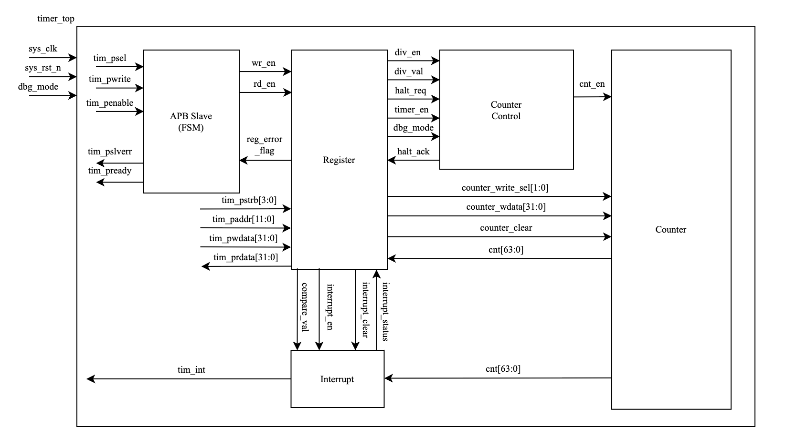

The top-level architecture of the Timer IP consists of five main sub-modules

- **APB Slave (`apb_slave`):** Manages the APB protocol, handling address decoding and generating internal read/write strobes. It also implements the logic for wait states and error responses.
- **Register File (`register`):** Contains all user-configurable and status registers. It serves as the central point for controlling the IP's behavior and observing its status.
- **Counter Control (`counter_control`):** Generates the final count enable signal (`cnt_en`) for the main counter based on the timer enable, divisor settings, and debug halt requests.
- **Counter (`counter`):** The core 64-bit synchronous up-counter.
- **Interrupt Logic (`interrupt`):** Compares the counter value with the compare register value and manages the interrupt status logic (setting, clearing, and masking).

## 2. Project Structure

The repository is organized into the following directories:

```[]
.
├── block_diagram/ # Contains the IP's block diagram image
├── rtl/          # All RTL source files (Verilog)
├── sim/          # Simulation scripts and environment
├── tb/           # Testbench files
└── waveform/     # Saved waveform files
```

## 3. Detailed Functional Description

### 3.1. APB Slave (`apb_slave`)

#### Interface Signals

| Signal Name      | Width   | Direction | Description                                 |
|------------------|---------|-----------|---------------------------------------------|
| `sys_clk`        | 1-bit   | Input     | System Clock                                |
| `sys_rst_n`      | 1-bit   | Input     | Active-low Asynchronous Reset               |
| `tim_psel`       | 1-bit   | Input     | APB Slave Select                            |
| `tim_pwrite`     | 1-bit   | Input     | APB Write Control                           |
| `tim_penable`    | 1-bit   | Input     | APB Enable                                  |
| `reg_error_flag` | 1-bit   | Input     | Error flag from the Register File           |
| `tim_pready`     | 1-bit   | Output    | APB Ready Signal                            |
| `tim_pslverr`    | 1-bit   | Output    | APB Error Signal                            |
| `wr_en`          | 1-bit   | Output    | Write Enable strobe to Register File        |
| `rd_en`          | 1-bit   | Output    | Read Enable strobe to Register File         |

#### Functional Description

The `apb_slave` module acts as the bridge between the system's APB bus and the timer's internal logic. It implements a standard 3-state APB state machine (`IDLE`, `SETUP`, `ACCESS`) with one wait state. Its primary responsibilities are:

- **Protocol Handling:** To sequence through the APB states based on `tim_psel` and `tim_penable`. It can handle transactions with wait states by remaining in the `SETUP` or `ACCESS` state if `tim_penable` is held low.
- **Strobe Generation:** In the `ACCESS` state, it generates single-cycle `wr_en` or `rd_en` pulses based on the `tim_pwrite` signal. These strobes signal to the `register` module that a valid transaction is occurring.
- **Error Response:** It monitors the `reg_error_flag` from the `register` module. If an error is detected during a transaction, it asserts `tim_pslverr` concurrently with `tim_pready` to notify the APB master of the fault.

#### Logic Diagram

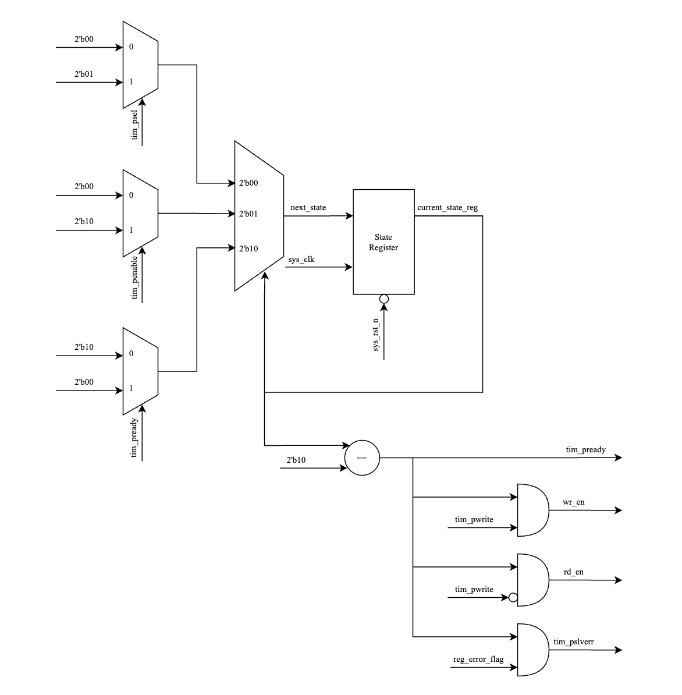

The logic consists of a state register for the FSM and combinational logic that generates the outputs (`tim_pready`, `tim_pslverr`, `wr_en`, `rd_en`) based on the current state and the APB inputs.

#### Waveform Analysis

APB Write:


APB Read:
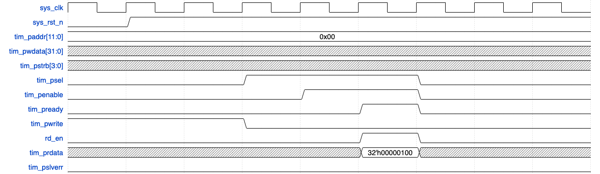

APB Write Error:
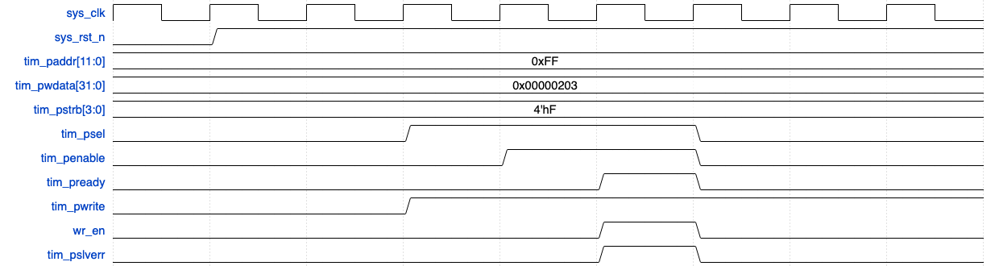

We show three waveform, write, read and write error which is typical of apb interface

### 3.2. Register File (`register`)

#### Interface Signals

| Signal Group      | Direction     | Description                                                                                   |
|-------------------|--------------|-----------------------------------------------------------------------------------------------|
| APB Data/Control  | Input/Output | Connects to `apb_slave` for register access (`wr_en`, `rd_en`, `tim_paddr`, etc.).            |
| Counter Status    | Input        | Receives the live 64-bit counter value (`cnt_val`).                                           |
| Interrupt Status  | Input        | Receives the sticky interrupt status (`interrupt_status`).                                    |
| Halt Status       | Input        | Receives the halt acknowledge status (`halt_ack_status`).                                     |
| Control Outputs   | Output       | Drives control signals to other modules (e.g., `timer_en`, `div_val`, `compare_val`).         |
| Command Outputs   | Output       | Drives command pulses to other modules (e.g., `counter_clear`, `interrupt_clear`).            |

#### Functional Description

The `register` module is the control hub of the IP. It contains all user-accessible registers and orchestrates the behavior of the other modules.

- **Address Decoding:** It decodes the incoming `tim_paddr` to select one of the eight registers for a read or write operation .
- **Write Logic:** When `wr_en` is asserted, it writes `tim_pwdata` into the selected register. It respects the `tim_pstrb` signals to perform byte-lane-specific writes, allowing for partial updates to registers like `TCR` and `TCMP0/1` .
- **Read Logic:** For read operations (`rd_en` asserted), a large multiplexer selects the appropriate data source—either an internal configuration register (like `tcr_reg`) or a live status signal from another module (like `cnt_val` or `interrupt_status`)—and drives it onto `tim_prdata` .
- **Error Logic:** It contains the logic to detect prohibited operations. It asserts `reg_error_flag` under two conditions: (1) an attempt is made to change `div_en` or `div_val` while the timer is running (`timer_en` is high), or (2) a write attempts to set `div_val` to a reserved value greater than 8 .

### 3.3. Counter Control (`counter_control`)

#### Interface Signals

| Signal Name      | Width   | Direction | Description                                      |
|------------------|---------|-----------|--------------------------------------------------|
| `sys_clk`        | 1-bit   | Input     | System Clock                                     |
| `sys_rst_n`      | 1-bit   | Input     | Active-low Asynchronous Reset                    |
| `timer_en`       | 1-bit   | Input     | Master timer enable from Register File           |
| `div_en`         | 1-bit   | Input     | Divisor mode enable from Register File           |
| `div_val`        | 4-bit   | Input     | Divisor value from Register File                 |
| `halt_req`       | 1-bit   | Input     | Halt request from Register File                  |
| `dbg_mode`       | 1-bit   | Input     | Top-level debug mode signal                      |
| `cnt_en`         | 1-bit   | Output    | Qualified count enable pulse to Counter          |
| `halt_ack_status`| 1-bit   | Output    | Halt acknowledge status to Register File         |

#### Functional Description

The `counter_control` module's sole purpose is to generate the final, qualified count enable signal, `cnt_en`, which dictates when the main counter increments.

- **Counting Modes**: It selects between two modes based on the `div_en` signal from the register file:
  - **Default Mode (`div_en` = 0)**: `cnt_en` simply follows the state of `timer_en`.
  - **Control Mode (`div_en` = 1)**: The module uses an internal 8-bit divisor counter. This counter increments on every `sys_clk` cycle until it reaches a `limit` value, which is combinatorially calculated as $(2^{div\_val} - 1)$. When the limit is reached, `cnt_en` is pulsed for one clock cycle, and the divisor counter resets.

- **Halt Logic**: The final `cnt_en` output is gated by the halt logic. The signal is forced to '0' if a halt is acknowledged (`halt_ack_status` is high), effectively freezing the counter regardless of other settings. `halt_ack_status` is asserted only when both `halt_req` and the top-level `dbg_mode` input are high.

#### Logic Diagram

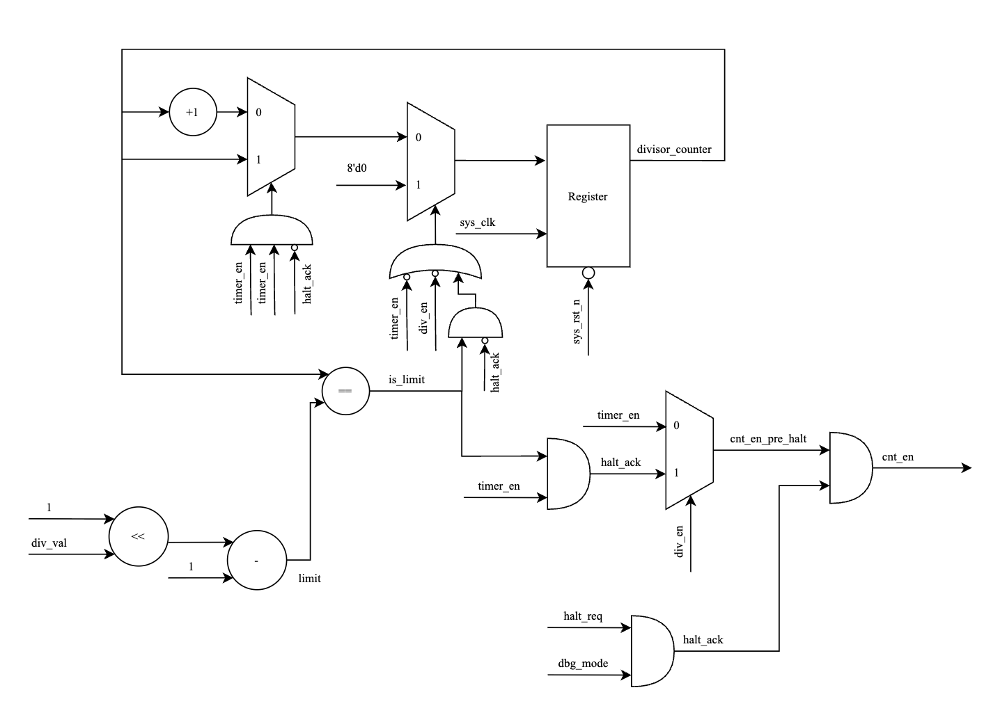

#### Waveform Analysis

This waveform demonstrates how the `cnt_en` pulse frequency changes based on different `div_val` settings, directly affecting the speed of the main counter.

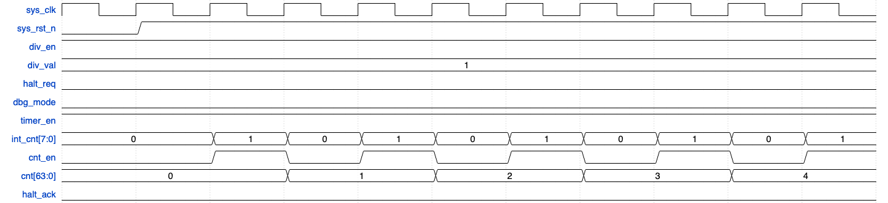
**div\_val = 1 (Divide by 2)**: The internal divisor counter's limit is $(2^1-1) = 1$. It counts `0, 1`. A `cnt_en` pulse is generated every **2** clock cycles.

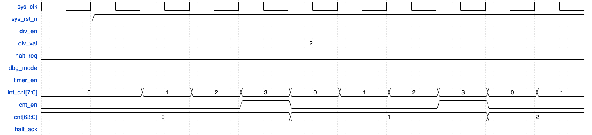
**div\_val = 2 (Divide by 4)**: The limit is $(2^2-1) = 3$. The internal counter counts `0, 1, 2, 3`. A `cnt_en` pulse is generated every **4** clock cycles.

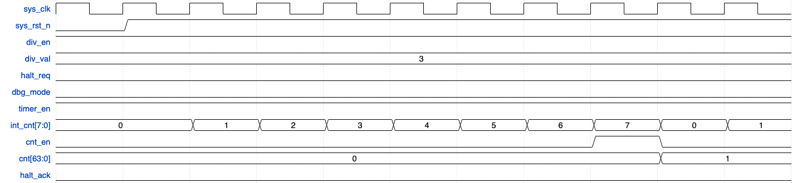
**div\_val = 3 (Divide by 8)**: The limit is $(2^3-1) = 7$. A `cnt_en` pulse is generated every **8** clock cycles, causing the main counter to increment at one-eighth the speed of the system clock.

### 3.4. Counter (`counter`)

#### Interface Signals

| Signal Name         | Width    | Direction | Description                                 |
|---------------------|----------|-----------|---------------------------------------------|
| `sys_clk`           | 1-bit    | Input     | System Clock                                |
| `sys_rst_n`         | 1-bit    | Input     | Active-low Asynchronous Reset               |
| `cnt_en`            | 1-bit    | Input     | Count enable pulse from Counter Control     |
| `counter_clear`     | 1-bit    | Input     | Clears the counter to zero                  |
| `counter_write_data`| 32-bit   | Input     | 32-bit data for direct write operations     |
| `counter_write_sel` | 2-bit    | Input     | Selects lower (`'b01`) or upper (`'b10`) half for writes |
| `cnt_val`           | 64-bit   | Output    | The current 64-bit counter value            |

#### Functional Description

The `counter` module is a straightforward 64-bit register block that serves as the core of the timer. Its operation is dictated by control signals from the `register` and `counter_control` modules.

- **Increment**: It increments its value by one on every rising clock edge where `cnt_en` is active.
- **Clear**: It synchronously resets its value to zero when `counter_clear` is asserted. This occurs automatically when the timer is disabled (`timer_en` H-\>L).
- **Direct Write**: It can be loaded with a specific 64-bit value through APB writes to the `TDR0` and `TDR1` registers. The `counter_write_sel` signal determines which 32-bit half of the counter is being written.

#### Logic Diagram

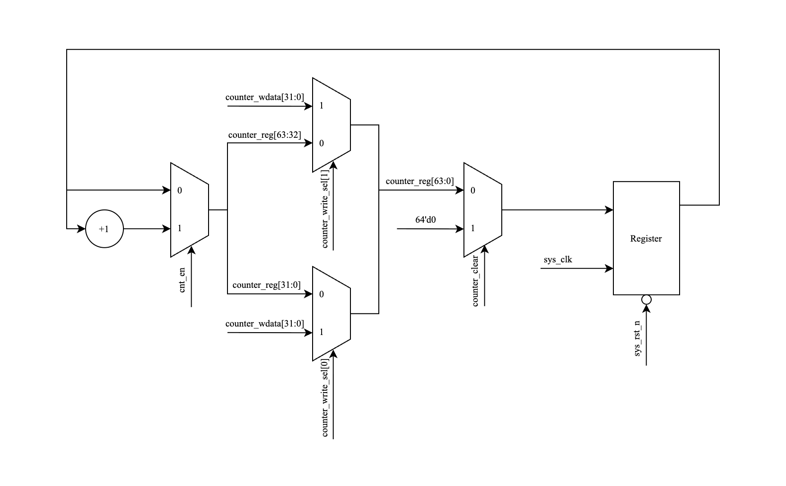

The logic consists of a 64-bit register with prioritized synchronous control. The highest priority is given to the `counter_clear` signal, followed by the direct write signals (`counter_write_sel`), and finally the increment logic enabled by `cnt_en`.

#### Waveform Analysis

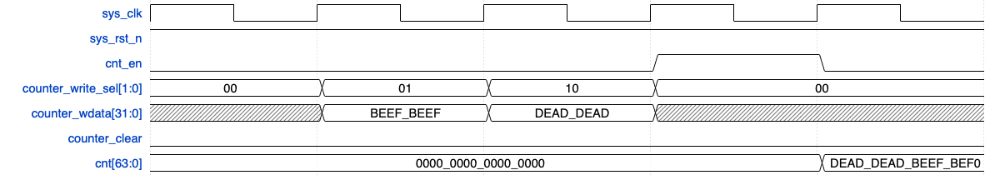

This waveform shows how the testbench can directly load a value into the 64-bit counter register.

- **Write to TDR1**: An APB write is performed to the `TDR0` address (`0x004`) with the data `0xBEEF_BEEF`. The `register` module asserts `counter_write_sel` with a value of `2'b01`, loading the data into the lower 32 bits of `counter_reg`.
- **Write to TDR0**: Immediately following, an APB write to the `TDR1` address (`0x008`) with the data `0xDEAD_DEAD` occurs. The `register` module asserts `counter_write_sel` with `2'b10`, loading the data into the lower 32 bits.
- **Result**: The `cnt_val` output now reflects the full 64-bit value `{32'hDEAD_DEAD, 32'hBEEF_BEEF}` and upon the next cnt_en signal is it incremented to `64'hDEAD_DEAD_BEEF_BEF0`.

### 3.5. Interrupt Logic (`interrupt`)

#### Functional Description

This module implements the interrupt generation and status logic. Its operation is simple and robust:

- **Comparison:** A 64-bit comparator continuously checks if `cnt_val` is equal to `compare_val`.
- **Status Latch:** The output of this comparator acts as the "set" condition for the `interrupt_status` flip-flop. Once a match occurs, `interrupt_status` is set to '1' and remains high even after the counter increments and no longer matches the compare value. This is the "sticky" behavior required for status bits.
- **Clearing:** The `interrupt_status` flip-flop is cleared back to '0' only when the `interrupt_clear` signal (generated by a write to the `TISR` register) is asserted.
- **Masking:** The final `tim_int` output is a simple AND combination of the `interrupt_status` and the `interrupt_en` signal from the `TIER` register. This allows software to enable or disable the interrupt signal from reaching the system's interrupt controller without affecting the underlying status bit.

#### Logic Diagram


The logic is composed of three main parts: the 64-bit equality comparator, the D-flip-flop for `interrupt_status` with asynchronous clear and synchronous set logic, and the final AND gate for the output masking.

#### Waveform Analysis

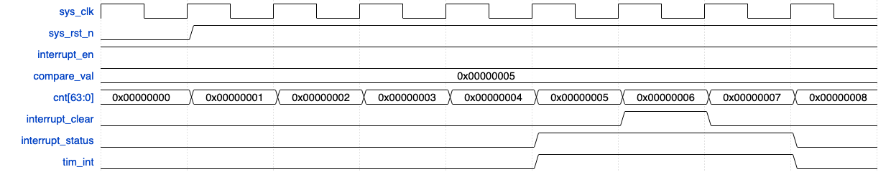

This waveform demonstrates the full interrupt lifecycle.

1. The `compare_val` is set to `0x5`. `interrupt_en` is high.
2. The `cnt_val` increments and eventually reaches `0x5`.
3. On the clock edge after the match, `interrupt_status` asserts high. Because `interrupt_en` is high, `tim_int` also asserts high.
4. On the next cycle, `cnt_val` increments to `0x6`. The match condition is no longer true, but both `interrupt_status` and `tim_int` remain high due to the sticky nature of the status bit.
5. Performs an APB write to `TISR`, which generates a one-cycle `interrupt_clear` pulse.
6. This pulse synchronously clears the `interrupt_status` flip-flop, causing both `interrupt_status` and `tim_int` to de-assert.

## 4. Interface Signals

The top-level module `timer_top` has the following interface signals:

|Signal Name|Width|Direction|Description|
|---|---|---|---|
|`sys_clk`|1-bit|Input|System clock.|
|`sys_rst_n`|1-bit|Input|Active-low asynchronous reset.|
|**APB Interface**||||
|`tim_psel`|1-bit|Input|APB slave select.|
|`tim_pwrite`|1-bit|Input|APB write control (1'b1 for write, 1'b0 for read).|
|`tim_penable`|1-bit|Input|APB enable signal for the access phase.|
|`tim_paddr`|12-bit|Input|APB address bus.|
|`tim_pwdata`|32-bit|Input|APB write data bus.|
|`tim_pstrb`|4-bit|Input|APB write strobe for byte-level access.|
|`tim_pready`|1-bit|Output|APB ready signal, asserted when the slave is ready.|
|`tim_prdata`|32-bit|Output|APB read data bus.|
|`tim_pslverr`|1-bit|Output|APB error signal for prohibited accesses.|
|**Interrupt Output**||||
|`tim_int`|1-bit|Output|Final timer interrupt output to the system.|
|**Debug Input**||||
|`dbg_mode`|1-bit|Input|Debug mode indicator from the system.|

## 5. Register Specification

### 5.1. Register Summary

|Offset|Abbreviation|Register Name|Width|
|---|---|---|---|
|`0x000`|TCR|Timer Control Register|32-bit|
|`0x004`|TDR0|Timer Data Register 0 (lower)|32-bit|
|`0x008`|TDR1|Timer Data Register 1 (upper)|32-bit|
|`0x00C`|TCMP0|Timer Compare Register 0 (lower)|32-bit|
|`0x010`|TCMP1|Timer Compare Register 1 (upper)|32-bit|
|`0x014`|TIER|Timer Interrupt Enable Register|32-bit|
|`0x018`|TISR|Timer Interrupt Status Register|32-bit|
|`0x01C`|THCSR|Timer Halt Control Status Register|32-bit|

### 5.2. Detailed Register Maps

#### **TCR (Timer Control Register)** - Offset: `0x000`

- **Reset Value**: `0x0000_0100`

|Bit(s)|Field Name|Type|Description|
|---|---|---|---|
|31:12|Reserved|RO|Reserved|
|11:8|`div_val`|RW|Sets the counter divisor when `div_en` is active. A value of `N` divides the count rate by 2N. Values `0x9`-`0xF` are prohibited. Default `0x1` (/2).|
|7:2|Reserved|RO|Reserved|
|1|`div_en`|RW|**0**: Counter increments with `sys_clk` (default). **1**: Counter increments at the rate specified by `div_val`.|
|0|`timer_en`|RW|**0**: Timer is disabled, and the counter is held at reset. **1**: Timer is enabled and counting.|

#### **TDR0/TDR1 (Timer Data Registers)** - Offsets: `0x004`/`0x008`

- **Reset Value**: `0x0000_0000`
- These registers allow direct read/write access to the lower 32 bits (`TDR0`) and upper 32 bits (`TDR1`) of the 64-bit counter.

#### **TCMP0/TCMP1 (Timer Compare Registers)** - Offsets: `0x00C`/`0x010`

- **Reset Value**: `0xFFFF_FFFF`
- These registers hold the 64-bit value that is continuously compared against the counter. An interrupt is triggered upon a match.

#### **TIER (Timer Interrupt Enable Register)** - Offset: `0x014`

- **Reset Value**: `0x0000_0000`

|Bit(s)|Field Name|Type|Description|
|---|---|---|---|
|31:1|Reserved|RO|Reserved.|
|0|`int_en`|RW|**0**: The timer interrupt (`tim_int`) is disabled (masked). **1**: The timer interrupt is enabled.|

#### **TISR (Timer Interrupt Status Register)** - Offset: `0x018`

- **Reset Value**: `0x0000_0000`

|Bit(s)|Field Name|Type|Description|
|---|---|---|---|
|31:1|Reserved|RO|Reserved.|
|0|`int_st`|RW1C|**Interrupt Status (Sticky Bit)**: **0**: No match has occurred. **1**: A counter/compare match has occurred. This bit remains high until cleared by writing a '1' to it.|

#### **THCSR (Timer Halt Control Status Register)** - Offset: `0x01C`

- **Reset Value**: `0x0000_0000`

|Bit(s)|Field Name|Type|Description|
|---|---|---|---|
|31:2|Reserved|RO|Reserved|
|1|`halt_ack`|RO|**Halt Acknowledge**: **0**: Timer is not halted. **1**: Timer is halted (occurs only when `halt_req=1` and `dbg_mode=1`).|
|0|`halt_req`|RW|**Halt Request**: **0**: No halt request. **1**: Request to halt the timer. The timer will only halt if the `dbg_mode` input is also high.|

## 6. Verification Strategy

The IP was verified using a self-checking testbench (`tb/test_bench.v`) written in Verilog. The verification strategy focused on covering all specified features, corner cases, and error conditions.

- **Test Cases:** The test suite includes checks for reset values, register access (read/write, byte access), all counting modes, interrupt logic (trigger, sticky, clear, mask), debug halt functionality, and APB protocol violations (aborts, wait states).
- **Coverage:** **100% functional coverage** was achieved, with all features in the verification plan tested.
- **Code Coverage:** Using coverage analysis tools, **100% Code Coverage** (Statement, Branch, Condition, Expression, FSM) and **100% Toggle Coverage** were achieved for the DUT after applying necessary exclusions for untestable logic (e.g., read-only reserved bits). The exclusion file can be found at `sim/exclude.do`.

## 7. Verification Plan

This document outlines the verification strategy for the Timer IP. The plan is derived directly from the implemented test cases in the `test_bench.v` module. Each item corresponds to a specific test sequence designed to validate a feature or corner case of the design.

| Test Case Name (in TB) | Item Name | Description | Test Sequence | Pass Condition |
| :--- | :--- | :--- | :--- | :--- |
| **Reset and Register Access** | | | | |
| `RESET_DEFAULTS` | Register Default Values | Verify all configuration and status registers reset to their specified default values. | 1. Apply system reset. 2. Read TCR, TCMP0/1, TIER, and THCSR registers. | The read-back values must match their specified defaults: `tcr` = `0x0100`, `tcmp0`/`tcmp1` = `0xFFFFFFFF`, `tier` = `0x0`, `thcsr` = `0x0`. |
| `RW_ACCESS_TCMP` | Basic Read/Write Access | Verify a standard read/write register (`TCMP0`) can be written to and read from correctly. | 1. Write `0xDEADBEEF` to `TCMP0_ADDR`. 2. Read back from `TCMP0_ADDR`. | The data read back is equal to `0xDEADBEEF`. |
| `BYTE_ACCESS_*` | Byte Strobe Access | Verify that byte strobes (`tim_pstrb`) correctly enable writes to specific byte lanes while leaving other bytes unchanged. | 1. **TCR**: Write to byte 1 only (`pstrb=4'b0010`). 2. **TCMP0**: Write to bytes 0 and 3 only (`pstrb=4'b1001`). 3. **Comprehensive**: Perform writes to TCMP, TIER, and THCSR with various strobes disabled, including no-op writes (`pstrb=4'b0000`)| In all cases, only the byte lanes corresponding to an active strobe bit are modified. All other bytes in the register remain unchanged. |
| **Counter Functionality** | | | | |
| `COUNT_DEFAULT_MODE` | Default Counting Mode | Verify the counter increments on every clock cycle when `div_en=0` and `timer_en=1`. | 1. Set `timer_en=1`. 2. Wait for a fixed number of clock cycles (e.g., 10). 3. Read the counter value from `TDR0`. | The final count matches the number of elapsed cycles [accounting for simulation timing artifacts]. |
| `COUNT_DIV_MODE_*` | Divided Counting Modes | Verify the counter increments at the correct divided rate for all supported `div_val` settings (0 through 8). | For each `div_val` setting: 1. Set `timer_en=1` and `div_en=1`. 2. Set the desired `div_val`. 3. Wait for a fixed number of cycles. 4. Read the counter value. | The final count correctly reflects the number of increment pulses generated, which should be `(cycles_waited / 2^div_val)`. |
| `COUNT_CLEAR_ON_DISABLE` | Hardware Counter Clear | Verify the counter is automatically cleared to `0` when `timer_en` transitions from high to low. | 1. Enable the timer and let it count for several cycles. 2. Disable the timer by writing `timer_en=0`. 3. Read the counter value from `TDR0`. | The read-back counter value is `0`. |
| `COUNT_DIRECT_WRITE` | Direct Counter Write | Verify that software can write a specific value directly to the 64-bit counter via the `TDR0` and `TDR1` registers. | 1. Disable the timer. 2. Write a 32-bit value to `TDR1`. 3. Write a 32-bit value to `TDR0`. 4. Read back from both `TDR0` and `TDR1`. | The values read from `TDR0` and `TDR1` match the values that were written. |
| `COUNT_ROLLOVER_32B` | 32-bit Rollover | Verify the counter correctly handles a rollover from the lower 32 bits to the upper 32 bits. | 1. Write `0x00000000` to `TDR1` and `0xFFFFFFFF` to `TDR0`. 2. Enable the timer and let it run for several cycles. 3. Read `TDR0` and `TDR1`. | The value of `TDR1` has incremented to `1`, and `TDR0` has wrapped around and continued counting from `0`. |
| **Interrupt Functionality** | | | | |
| `INTERRUPT_TRIGGER_STICKY` | Interrupt Trigger and Status | Verify the interrupt (`tim_int`) asserts when `cnt_val` equals `compare_val`, and that the status bit (`TISR[0]`) remains set ("sticky") even after the counter has passed the compare value. | 1. Set `TDR` to a value just below `TCMP`. 2. Enable the timer and the interrupt (`TIER[0]=1`). 3. Let the timer run past the compare value. 4. Check `tim_int` and read `TISR`. | `tim_int` asserts on the cycle of the match. The `TISR[0]` bit is set and remains set on subsequent cycles. |
| `INTERRUPT_MASK` | Interrupt Masking | Verify that setting `TIER[0]=0` masks the `tim_int` output but does not affect the sticky status bit in `TISR`. | 1. With an interrupt pending (`TISR[0]=1`), write `0` to `TIER`. 2. Check the `tim_int` output and read `TISR`. | The `tim_int` output is low, but `TISR[0]` remains high. |
| `INTERRUPT_CLEAR` | Interrupt Clearing | Verify that writing a '1' to `TISR[0]` clears the pending interrupt status and de-asserts `tim_int`. | 1. With an interrupt pending, write `1` to `TISR`. 2. Read `TISR`. | `TISR[0]` is cleared to `0`, and `tim_int` is low. |
| `INTERRUPT_CLEAR_NEGATIVE`| Negative Interrupt Clear | Verify that writing a '0' to a pending `TISR[0]` has no effect. | 1. With an interrupt pending, write `0` to `TISR`. 2. Read `TISR`. | `TISR[0]` remains `1`. |
| `INTERRUPT_CLEAR_PRIORITY`| Clear vs. Match Priority | Verify that if an interrupt clear command arrives in the same cycle as a new match event, the clear operation takes priority. | 1. Pre-load the counter to a value that will match the compare value on the next cycle. 2. Initiate an APB write to `TISR` to clear the interrupt, timed to land on the same cycle as the match. | The interrupt status bit `TISR[0]` remains `0`. |
| **Debug/Halt Functionality** | | | | |
| `HALT_BASIC` / `HALT_ACK` | Halt Operation | Verify the counter stops when `dbg_mode=1` and `halt_req=1`, and that the halt is acknowledged. | 1. Enable the timer. 2. Set `dbg_mode=1` and write `halt_req=1` to `THCSR`. 3. Read the counter value, wait, and read again. 4. Read `THCSR`. | The `halt_ack` bit (`THCSR[1]`) is `1`. The counter value does not change while halted. |
| `HALT_RESUME` | Halt Resume | Verify the counter resumes counting after `halt_req` is cleared. | 1. While the timer is halted, write `halt_req=0` to `THCSR`. 2. Wait several cycles and read the counter value. | The `halt_ack` bit is `0`. The final counter value is greater than the value it had when halted. |
| `HALT_NEGATIVE` / `HALT_NO_ACK` | Negative Halt Conditions | Verify the halt does not occur if only one of the required conditions (`dbg_mode=1` or `halt_req=1`) is met. | 1. Set `dbg_mode=0` but `halt_req=1`. 2. Let the timer run and check its value. 3. Read `THCSR`. | The `halt_ack` bit is `0`. The counter continues to increment normally. |
| **Error Handling (`pslverr`)** | | | | |
| `ERROR_FLAG_TIMER_RUNNING` | Prohibited Write (Running) | Verify `pslverr` is asserted when trying to change `div_val` or `div_en` while `timer_en=1`. | 1. Enable the timer. 2. Attempt to write a new value to `TCR` that changes the divisor settings. 3. Read `TCR` back after the failed write. | `tim_pslverr` asserts during the write transaction. The `TCR` value remains unchanged. |
| `ERROR_FLAG_PROHIBITED_VAL` | Prohibited Write (Value) | Verify `pslverr` is asserted when writing a prohibited value (e.g., `0xF`) to `div_val`. | 1. Disable the timer. 2. Attempt to write a prohibited value to `div_val`. 3. Read `TCR` back. | `tim_pslverr` asserts during the write. The `TCR` value remains unchanged. |
| `ERROR_CONCURRENT` | Concurrent Error Conditions | Verify `pslverr` is asserted if a single write attempts to trigger both error conditions simultaneously. | 1. Enable the timer. 2. Attempt a write to `TCR` that sets a prohibited `div_val`. | `tim_pslverr` asserts during the write transaction. |
| **APB Protocol Corner Cases** | | | | |
| `APB_ABORT` | Aborted Transaction | Verify that a transaction is correctly aborted if `tim_psel` is de-asserted during the `SETUP` phase. | 1. Initiate a write transaction but de-assert `tim_psel` after one cycle (in the `SETUP` phase). 2. Read the target register. | The target register's value is unchanged, confirming the write was aborted. |
| `APB_BACK_TO_BACK` | Back-to-Back Transactions | Verify the slave correctly handles a write immediately followed by a read with no idle cycles in between. | 1. Manually sequence an APB write. 2. On the cycle immediately following the `ACCESS` phase of the write, begin the `SETUP` phase of a read to the same address. | The read transaction completes successfully and returns the data that was just written. |
| `APB_SETUP_WAIT` | Setup Wait State | Verify the slave can handle a wait state by remaining in the `SETUP` phase. | 1. Manually sequence an APB transaction. 2. Hold the FSM in the `SETUP` state for several cycles by keeping `tim_penable=0`. 3. Complete the transaction. | The write/read operation completes successfully after the wait state. |
| `APB_ACCESS_WAIT` | Access Wait State | Verify the slave correctly de-asserts `tim_pready` if `tim_penable` goes low during the `ACCESS` phase. | 1. Manually enter the `ACCESS` phase. 2. De-assert `tim_penable` for several cycles. 3. Re-assert `tim_penable` to complete the transaction. | The transaction completes successfully once `tim_penable` is re-asserted. |

## 8. How to Run Simulation

The simulation can be run using a script located in the `sim/` directory. From the `sim/` directory, execute the following command:

Bash

```[]
make all_wave
```

This will compile the RTL and testbench, run the full regression test suite, and generate a coverage report in the `Report/` directory.
