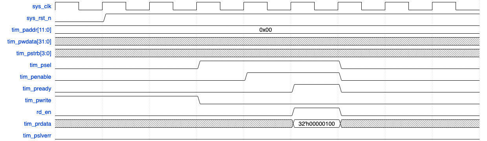
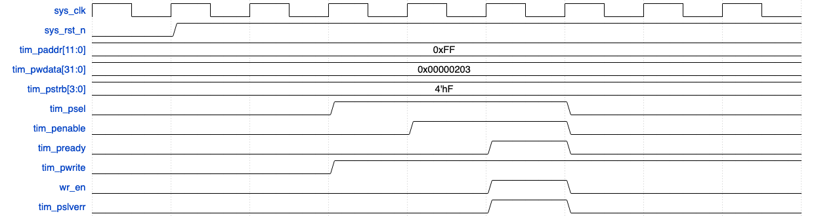
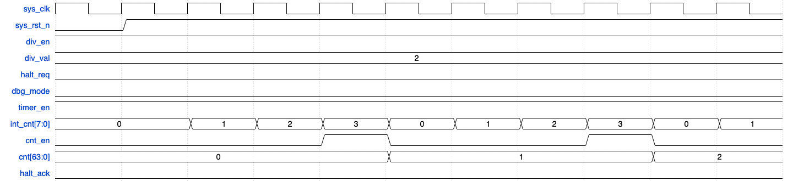
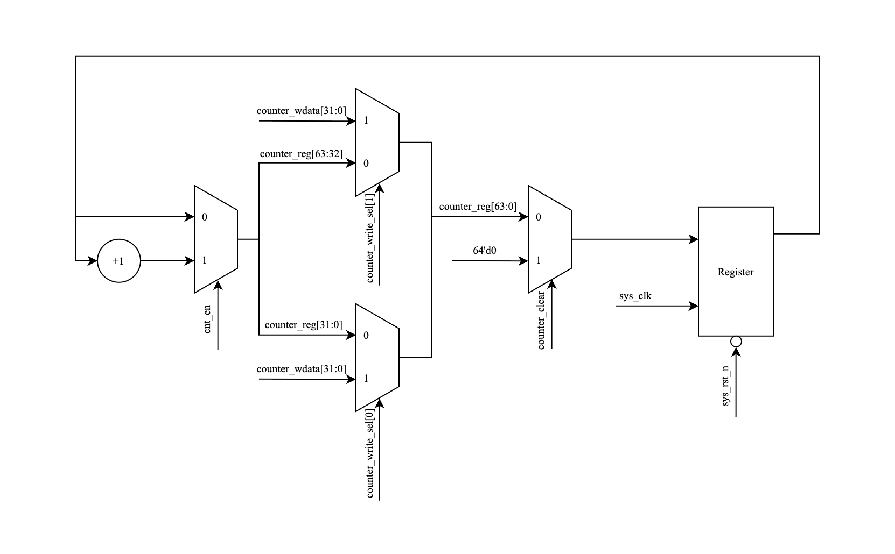
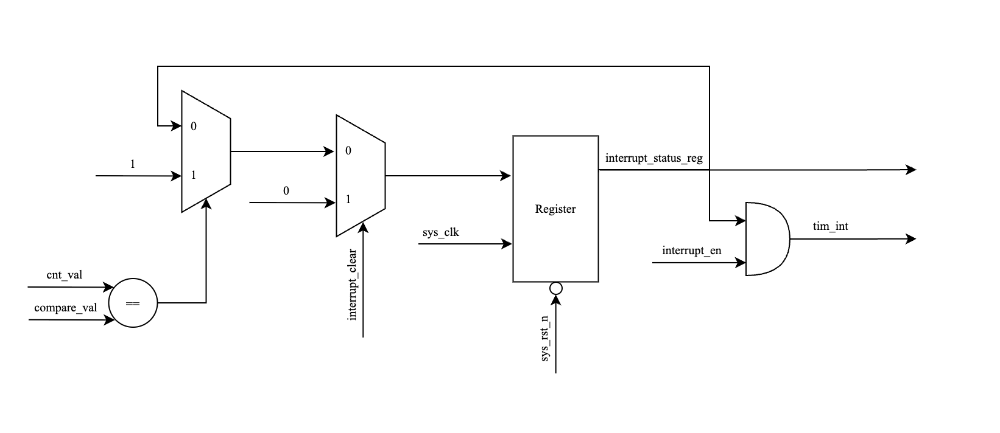

# Timer IP Core with APB Interface

## 1. Overview

### 1.1. Introduction

This project is a comprehensive implementation of a 64-bit count-up Timer IP core. It features a fully compliant APB slave interface for configuration and control. The primary function of this IP is to maintain a continuous count and generate a level-sensitive hardware interrupt when the counter's value matches a user-programmed compare value. The design is inspired by the CLINT (Core Local Interruptor) module found in industrial RISC-V architectures and is intended for use in System-on-Chip (SoC) environments.

### 1.2. Main Features

The key features include:

- **64-bit Counter:** A full 64-bit synchronous count-up timer.
- **APB Slave Interface:** A 32-bit APB interface with a 12-bit address bus for register access.
- **Byte Access:** Supports partial register writes using the `tim_pstrb` signal for byte-level enables.
- **Wait State & Error Handling:** The APB slave can handle wait states and provides an error response (`tim_pslverr`) for prohibited register accesses.
- **Configurable Clocking:** The counter can be configured to increment on every system clock cycle or at a divided rate (from /2 up to /256).
- **Interrupt Generation:** Generates a maskable, level-triggered hardware interrupt when the counter value equals the compare value.
- **Debug Support:** The counter can be halted when the system enters debug mode.
- **Hardware Counter Clear:** The 64-bit counter is automatically cleared to zero whenever the timer is disabled (`timer_en` transitions from H->L), ensuring predictable behavior.

### 1.3. Block Diagram


The top-level architecture of the Timer IP consists of five main sub-modules

- **APB Slave (`apb_slave`):** Manages the APB protocol, handling address decoding and generating internal read/write strobes. It also implements the logic for wait states and error responses.
- **Register File (`register`):** Contains all user-configurable and status registers. It serves as the central point for controlling the IP's behavior and observing its status.
- **Counter Control (`counter_control`):** Generates the final count enable signal (`cnt_en`) for the main counter based on the timer enable, divisor settings, and debug halt requests.
- **Counter (`counter`):** The core 64-bit synchronous up-counter.
- **Interrupt Logic (`interrupt`):** Compares the counter value with the compare register value and manages the interrupt status logic (setting, clearing, and masking).

## 2. Project Structure

The repository is organized into the following directories:

```[]
.
├── block_diagram/ # Contains the IP's block diagram image
├── report/       # Coverage reports and other generated files
├── rtl/          # All RTL source files (Verilog)
├── sim/          # Simulation scripts and environment
├── tb/           # Testbench files
└── waveform/     # Saved waveform files (e.g., .wlf, .fsdb)
```

## 3. Detailed Functional Description

### 3.1. APB Slave (`apb_slave`)

#### Functional Description

The `apb_slave` module acts as the bridge between the system's APB bus and the timer's internal logic. It implements a standard 3-state APB state machine (`IDLE`, `SETUP`, `ACCESS`) with one wait state. Its primary responsibilities are:

- **Protocol Handling:** To sequence through the APB states based on `tim_psel` and `tim_penable`. It can handle transactions with wait states by remaining in the `SETUP` or `ACCESS` state if `tim_penable` is held low.
- **Strobe Generation:** In the `ACCESS` state, it generates single-cycle `wr_en` or `rd_en` pulses based on the `tim_pwrite` signal. These strobes signal to the `register` module that a valid transaction is occurring.
- **Error Response:** It monitors the `reg_error_flag` from the `register` module. If an error is detected during a transaction, it asserts `tim_pslverr` concurrently with `tim_pready` to notify the APB master of the fault.

#### Logic Diagram


The logic consists of a state register for the FSM and combinational logic that generates the outputs (`tim_pready`, `tim_pslverr`, `wr_en`, `rd_en`) based on the current state and the APB inputs.

#### Waveform Analysis

APB Write:


APB Read:


APB Write Error:


We show three waveform, write, read and write error which is typical of apb interface

### 3.2. Register File (`register`)

#### Functional Description

The `register` module is the control hub of the IP. It contains all user-accessible registers and orchestrates the behavior of the other modules.

- **Address Decoding:** It decodes the incoming `tim_paddr` to select one of the eight registers for a read or write operation .
- **Write Logic:** When `wr_en` is asserted, it writes `tim_pwdata` into the selected register. It respects the `tim_pstrb` signals to perform byte-lane-specific writes, allowing for partial updates to registers like `TCR` and `TCMP0/1` .
- **Read Logic:** For read operations (`rd_en` asserted), a large multiplexer selects the appropriate data source—either an internal configuration register (like `tcr_reg`) or a live status signal from another module (like `cnt_val` or `interrupt_status`)—and drives it onto `tim_prdata` .
- **Error Logic:** It contains the logic to detect prohibited operations. It asserts `reg_error_flag` under two conditions: (1) an attempt is made to change `div_en` or `div_val` while the timer is running (`timer_en` is high), or (2) a write attempts to set `div_val` to a reserved value greater than 8 .

### 2.3. Counter Control (`counter_control`)

#### Functional Description

The `counter_control` module's sole purpose is to generate the final, qualified count enable signal, `cnt_en`, which dictates when the main counter increments.

- **Counting Modes**: It selects between two modes based on the `div_en` signal from the register file:
  - **Default Mode (`div_en` = 0)**: `cnt_en` simply follows the state of `timer_en`.
  - **Control Mode (`div_en` = 1)**: The module uses an internal 8-bit divisor counter. This counter increments on every `sys_clk` cycle until it reaches a `limit` value, which is combinatorially calculated as $(2^{div\_val} - 1)$. When the limit is reached, `cnt_en` is pulsed for one clock cycle, and the divisor counter resets.

- **Halt Logic**: The final `cnt_en` output is gated by the halt logic. The signal is forced to '0' if a halt is acknowledged (`halt_ack_status` is high), effectively freezing the counter regardless of other settings. `halt_ack_status` is asserted only when both `halt_req` and the top-level `dbg_mode` input are high.

#### Logic Diagram


#### Waveform Analysis

This waveform demonstrates how the `cnt_en` pulse frequency changes based on different `div_val` settings, directly affecting the speed of the main counter.


**div\_val = 1 (Divide by 2)**: The internal divisor counter's limit is $(2^1-1) = 1$. It counts `0, 1`. A `cnt_en` pulse is generated every **2** clock cycles.


**div\_val = 2 (Divide by 4)**: The limit is $(2^2-1) = 3$. The internal counter counts `0, 1, 2, 3`. A `cnt_en` pulse is generated every **4** clock cycles.


**div\_val = 3 (Divide by 8)**: The limit is $(2^3-1) = 7$. A `cnt_en` pulse is generated every **8** clock cycles, causing the main counter to increment at one-eighth the speed of the system clock.

### 2.4. Counter (`counter`)

#### Functional Description

The `counter` module is a straightforward 64-bit register block that serves as the core of the timer. Its operation is dictated by control signals from the `register` and `counter_control` modules.

- **Increment**: It increments its value by one on every rising clock edge where `cnt_en` is active.
- **Clear**: It synchronously resets its value to zero when `counter_clear` is asserted. This occurs automatically when the timer is disabled (`timer_en` H-\>L).
- **Direct Write**: It can be loaded with a specific 64-bit value through APB writes to the `TDR0` and `TDR1` registers. The `counter_write_sel` signal determines which 32-bit half of the counter is being written.

#### Logic Diagram



The logic consists of a 64-bit register with prioritized synchronous control. The highest priority is given to the `counter_clear` signal, followed by the direct write signals (`counter_write_sel`), and finally the increment logic enabled by `cnt_en`.

#### Waveform Analysis


This waveform shows how the testbench can directly load a value into the 64-bit counter register.

<!-- Need to fix this -->
- **Write to TDR1**: An APB write is performed to the `TDR1` address (`0x008`) with the data `0xBEEF_BEEF`. The `register` module asserts `counter_write_sel` with a value of `2'b10`, loading the data into the upper 32 bits of `counter_reg`.
- **Write to TDR0**: Immediately following, an APB write to the `TDR0` address (`0x004`) with the data `0x1234_5678` occurs. The `register` module asserts `counter_write_sel` with `2'b01`, loading the data into the lower 32 bits.
- **Result**: The `cnt_val` output now reflects the full 64-bit value `{32'hAAAA_BBBB, 32'h1234_5678}`. This feature is useful for setting a specific starting count or for restoring a timer's state.

### 3.4. Interrupt Logic (`interrupt`)

#### Functional Description

This module implements the interrupt generation and status logic. Its operation is simple and robust:

- **Comparison:** A 64-bit comparator continuously checks if `cnt_val` is equal to `compare_val`.
- **Status Latch:** The output of this comparator acts as the "set" condition for the `interrupt_status` flip-flop. Once a match occurs, `interrupt_status` is set to '1' and remains high even after the counter increments and no longer matches the compare value. This is the "sticky" behavior required for status bits.
- **Clearing:** The `interrupt_status` flip-flop is cleared back to '0' only when the `interrupt_clear` signal (generated by a write to the `TISR` register) is asserted.
- **Masking:** The final `tim_int` output is a simple AND combination of the `interrupt_status` and the `interrupt_en` signal from the `TIER` register. This allows software to enable or disable the interrupt signal from reaching the system's interrupt controller without affecting the underlying status bit.

#### Logic Diagram



The logic is composed of three main parts: the 64-bit equality comparator, the D-flip-flop for `interrupt_status` with asynchronous clear and synchronous set logic, and the final AND gate for the output masking.

#### Waveform Analysis


This waveform demonstrates the full interrupt lifecycle.

1. The `compare_val` is set to `0x0...0A`. `interrupt_en` is high.
2. The `cnt_val` increments and eventually reaches `0x0...0A`.
3. On the clock edge after the match, `interrupt_status` asserts high. Because `interrupt_en` is high, `tim_int` also asserts high.
4. On the next cycle, `cnt_val` increments to `0x0...0B`. The match condition is no longer true, but both `interrupt_status` and `tim_int` remain high due to the sticky nature of the status bit.
5. Later, software performs an APB write to `TISR`, which generates a one-cycle `interrupt_clear` pulse.
6. This pulse asynchronously clears the `interrupt_status` flip-flop, causing both `interrupt_status` and `tim_int` to de-assert.

## 4. Interface Signals

The top-level module `timer_top` has the following interface signals:

|Signal Name|Width|Direction|Description|
|---|---|---|---|
|`sys_clk`|1-bit|Input|System clock.|
|`sys_rst_n`|1-bit|Input|Active-low asynchronous reset.|
|**APB Interface**||||
|`tim_psel`|1-bit|Input|APB slave select.|
|`tim_pwrite`|1-bit|Input|APB write control (1'b1 for write, 1'b0 for read).|
|`tim_penable`|1-bit|Input|APB enable signal for the access phase.|
|`tim_paddr`|12-bit|Input|APB address bus.|
|`tim_pwdata`|32-bit|Input|APB write data bus.|
|`tim_pstrb`|4-bit|Input|APB write strobe for byte-level access.|
|`tim_pready`|1-bit|Output|APB ready signal, asserted when the slave is ready.|
|`tim_prdata`|32-bit|Output|APB read data bus.|
|`tim_pslverr`|1-bit|Output|APB error signal for prohibited accesses.|
|**Interrupt Output**||||
|`tim_int`|1-bit|Output|Final timer interrupt output to the system.|
|**Debug Input**||||
|`dbg_mode`|1-bit|Input|Debug mode indicator from the system.|

## 5. Register Specification

### 5.1. Register Summary

|Offset|Abbreviation|Register Name|Width|
|---|---|---|---|
|`0x000`|TCR|Timer Control Register|32-bit|
|`0x004`|TDR0|Timer Data Register 0 (lower)|32-bit|
|`0x008`|TDR1|Timer Data Register 1 (upper)|32-bit|
|`0x00C`|TCMP0|Timer Compare Register 0 (lower)|32-bit|
|`0x010`|TCMP1|Timer Compare Register 1 (upper)|32-bit|
|`0x014`|TIER|Timer Interrupt Enable Register|32-bit|
|`0x018`|TISR|Timer Interrupt Status Register|32-bit|
|`0x01C`|THCSR|Timer Halt Control Status Register|32-bit|

### 5.2. Detailed Register Maps

#### **TCR (Timer Control Register)** - Offset: `0x000`

- **Reset Value**: `0x0000_0100`

|Bit(s)|Field Name|Type|Description|
|---|---|---|---|
|31:12|Reserved|RO|Read as zero.|
|11:8|`div_val`|RW|Sets the counter divisor when `div_en` is active. A value of `N` divides the count rate by 2N. Values `0x9`-`0xF` are prohibited. Default `0x1` (/2).|
|7:2|Reserved|RO|Read as zero.|
|1|`div_en`|RW|**0**: Counter increments with `sys_clk` (default). **1**: Counter increments at the rate specified by `div_val`.|
|0|`timer_en`|RW|**0**: Timer is disabled, and the counter is held at reset. **1**: Timer is enabled and counting.|

#### **TDR0/TDR1 (Timer Data Registers)** - Offsets: `0x004`/`0x008`

- **Reset Value**: `0x0000_0000`
- These registers allow direct read/write access to the lower 32 bits (`TDR0`) and upper 32 bits (`TDR1`) of the 64-bit counter.

#### **TCMP0/TCMP1 (Timer Compare Registers)** - Offsets: `0x00C`/`0x010`

- **Reset Value**: `0xFFFF_FFFF`
- These registers hold the 64-bit value that is continuously compared against the counter. An interrupt is triggered upon a match.

#### **TIER (Timer Interrupt Enable Register)** - Offset: `0x014`

- **Reset Value**: `0x0000_0000`

|Bit(s)|Field Name|Type|Description|
|---|---|---|---|
|31:1|Reserved|RO|Read as zero.|
|0|`int_en`|RW|**0**: The timer interrupt (`tim_int`) is disabled (masked). **1**: The timer interrupt is enabled.|

#### **TISR (Timer Interrupt Status Register)** - Offset: `0x018`

- **Reset Value**: `0x0000_0000`

|Bit(s)|Field Name|Type|Description|
|---|---|---|---|
|31:1|Reserved|RO|Read as zero.|
|0|`int_st`|RW1C|**Interrupt Status (Sticky Bit)**: **0**: No match has occurred. **1**: A counter/compare match has occurred. This bit remains high until cleared by writing a '1' to it.|

#### **THCSR (Timer Halt Control Status Register)** - Offset: `0x01C`

- **Reset Value**: `0x0000_0000`

|Bit(s)|Field Name|Type|Description|
|---|---|---|---|
|31:2|Reserved|RO|Read as zero.|
|1|`halt_ack`|RO|**Halt Acknowledge**: **0**: Timer is not halted. **1**: Timer is halted (occurs only when `halt_req=1` and `dbg_mode=1`).|
|0|`halt_req`|RW|**Halt Request**: **0**: No halt request. **1**: Request to halt the timer. The timer will only halt if the `dbg_mode` input is also high.|

## 6. Verification Strategy

The IP was verified using a self-checking testbench (`tb/test_bench.v`) written in Verilog. The verification strategy focused on covering all specified features, corner cases, and error conditions.

- **Test Cases:** The test suite includes checks for reset values, register access (read/write, byte access), all counting modes, interrupt logic (trigger, sticky, clear, mask), debug halt functionality, and APB protocol violations (aborts, wait states).
- **Coverage:** **100% functional coverage** was achieved, with all features in the verification plan tested.
- **Code Coverage:** Using coverage analysis tools, **100% Code Coverage** (Statement, Branch, Condition, Expression, FSM) and **100% Toggle Coverage** were achieved for the DUT after applying necessary exclusions for untestable logic (e.g., read-only reserved bits). The exclusion file can be found at `sim/exclude.do`.

## 7. How to Run Simulation

The simulation can be run using a script located in the `sim/` directory. From the `sim/` directory, execute the following command:

Bash

```[]
make all_wave
```

This will compile the RTL and testbench, run the full regression test suite, and generate a coverage report in the `Report/` directory.

## 8. Revision History

|Date|Version|Description|Author|
|---|---|---|---|
|2025-10-11|1.0|Initial release of the design and report|Le Phuc Khang|
